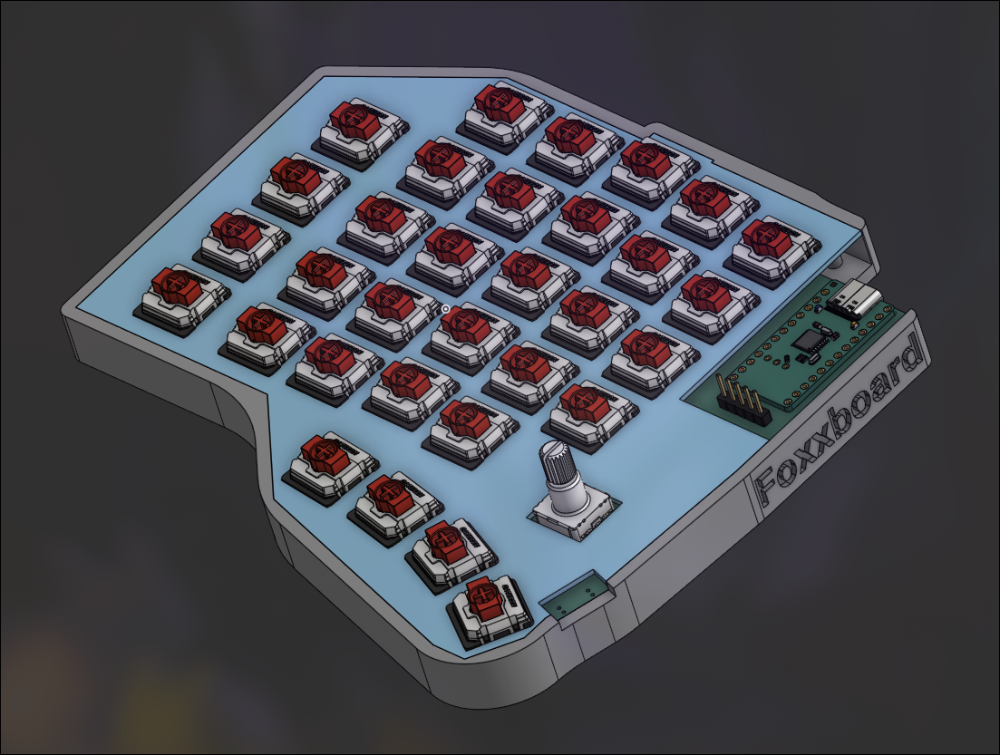
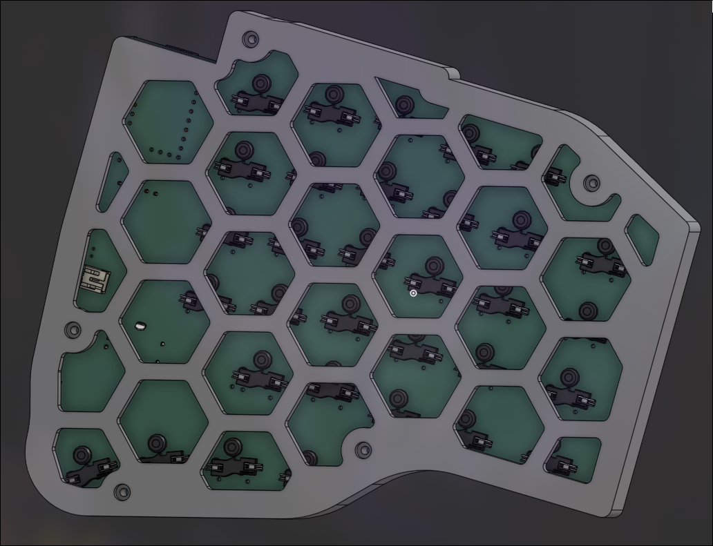

## Foxxboard: A Wireless, split ergonomic keyboard for normal keyboard users

*insert final image here*

# Features
- 64 key layout
- 4 key thumb cluster per side
- BLE wireless support using nice!nano v2
- Traditional pinky row using 1.5u keys
- Low profile using Gateron ks33 switches 
- 2x nice!view for low powered HUD
- Custom firmware written in RMK using Rust :ferrisyippee: 

## > [!NOTE]
> The firmware for the display module is still a WIP, but I'm talking with the head RMK dev 
> to get it fully running. The firmware bundled with this has parts of a display demo, and my 
> hackpad has a working display in RMK.

# PCB

# Renders

# BOM 

## > [!NOTE]
> I plan on printing my own case

| Name                 | Qty | Price             |
|----------------------|-----|-------------------|
| PCB                  | 5   | $14.59 w/shipping |
| GLP ks33 Banana      | 64  | $21.48 w/shipping |
| THT 1N4148 Diodes    | 64  | Hackclub          |
| EC11 Encoder         | 2   | $2.00 AliExpress  |
| True Nice!Nano V2    | 2   | $50               |
| Clone Nice!Nano V2   | 2   | $5.42 AliExpress  |
| GLP Hot-swap sockets | 100 | $8.42 AliExpress  |
| 0.91" OLED Display   | 2   | $3.20 AliExpress  |
| Nice!View            | 2   | $40.0             |
| 3.7v LiPo Battery    | 2   | $6.00             |
| EVQ-P7C01P Switch    | 2   | $0.56 Digikey     |

| Supplier    | Price (+ Shipping) | 
|-------------|--------------------|
| JLCPCB      | $14.59             |
| Keebio      | $22.48             |
| AliExpress  | $20.20             |
| Typeractive | $10.90             |
| Total       | $68.17             |

